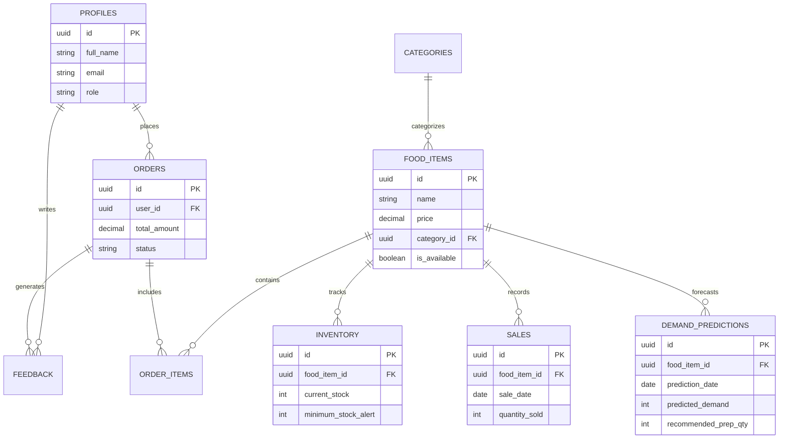

# SmartCanteen AI - System Architecture & Technical Specification

## 1. Architectural Overview

SmartCanteen AI is designed as a **decoupled, modern single-page web application** built with a FastAPI Python backend, a React + Vite frontend, Supabase/PostgreSQL database, Scikit-learn Machine Learning engine, and Google Gemini AI Assistant.

```mermaid
graph TB
    subgraph Client Layer ["Frontend (React + Vite + Tailwind CSS)"]
        SP[Student Portal]
        AD[Admin Dashboard]
        RC[Recharts Analytics]
        UI[UI Components & Toast]
    end

    subgraph API Layer ["Backend (FastAPI REST API)"]
        AuthRouter[/api/auth]
        ItemRouter[/api/items]
        OrderRouter[/api/orders]
        InvRouter[/api/inventory]
        MLRouter[/api/predictions]
        AIRouter[/api/ai-insights]
    end

    subgraph ML & AI Engine ["Intelligence Layer"]
        ML[Scikit-learn Demand Predictor]
        Gemini[Google Gemini API Insights Engine]
    end

    subgraph Data Layer ["Database (Supabase / PostgreSQL)"]
        DB[(PostgreSQL / Supabase)]
    end

    SP --> AuthRouter & ItemRouter & OrderRouter
    AD --> InvRouter & MLRouter & AIRouter & RC
    MLRouter --> ML
    AIRouter --> Gemini
    AuthRouter & ItemRouter & OrderRouter & InvRouter & MLRouter --> DB
    ML -->|Fetch Historical Sales / Save Predictions| DB
    Gemini -->|Fetch Live Context| DB
```

---

## 2. Component Design

### 2.1 Student Portal
- **Menu Browser**: Browse food items filtered by category (Snacks, South Indian, Main Course, Beverages).
- **Cart & Checkout**: Add items, set quantities, real-time total price calculation, place orders.
- **Order Tracking**: View current order status (`pending` -> `preparing` -> `ready` -> `completed`).
- **Rating & Feedback**: Leave 1-5 star ratings and reviews per ordered item.

### 2.2 Admin Dashboard
- **Live Canteen Stats**: Today's orders count, revenue stats, active orders queue.
- **Item & Category Manager**: Add/edit/delete canteen food items and categories.
- **Inventory Management**: Track current stock levels and receive visual low-stock alerts.
- **ML Demand Prediction**: View forecasted demand for tomorrow and recommended preparation quantities.
- **Sales Analytics**: Visual charts powered by Recharts (Daily sales trends, popular food items).
- **Gemini AI Canteen Insights**: Ask queries like *"What should we prepare tomorrow?"* or *"Which items have low stock?"*.

---

## 3. Database Schema Design (Entity-Relationship)



---

## 4. Machine Learning Module Specifications

- **Goal**: Forecast tomorrow's food demand to reduce food waste and prevent stockouts.
- **Algorithm**: Ridge / Time-Series Regression with lag & seasonal features.
- **Features Used**:
  - `day_of_week` (Monday-Sunday seasonality)
  - `is_weekend` (Binary)
  - `lag_1_day_sales` & `lag_7_day_sales`
  - `rolling_7_day_avg`
- **Output Formula**:
  - `Predicted Demand` = $\hat{y}$ from Regression model.
  - `Recommended Preparation` = $\text{ceil}(\hat{y} \times 1.10)$ (10% safety buffer).

---

## 5. Gemini AI Assistant Design

- **Goal**: Provide operational advice to canteen admins in simple English.
- **Prompt Architecture**:
  - Context payload injected automatically:
    - Current low stock items list
    - Tomorrow's top 5 predicted demand items
    - Top 5 popular items by overall sales
    - Recent customer ratings summary
- **Gemini Model**: `gemini-2.5-flash` or `gemini-1.5-flash`.

---

## 6. Viva Voce Defense Strategy

1. **Why FastAPI over Django/Flask?**
   FastAPI provides asynchronous performance, automatic OpenAPI documentation, and native Pydantic type validation.
2. **Why Scikit-Learn over Deep Learning?**
   Small to medium tabular time series are solved efficiently with linear/lag regression without risk of overfitting or heavy GPU requirements.
3. **How does the system prevent food wastage?**
   By comparing historical sales trends and recommending precise preparation quantities with a calibrated safety factor, avoiding over-preparation.
